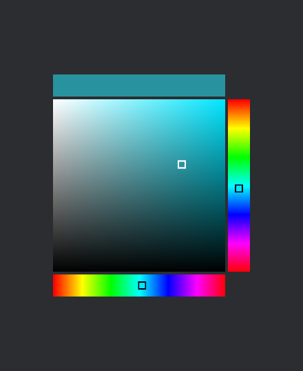
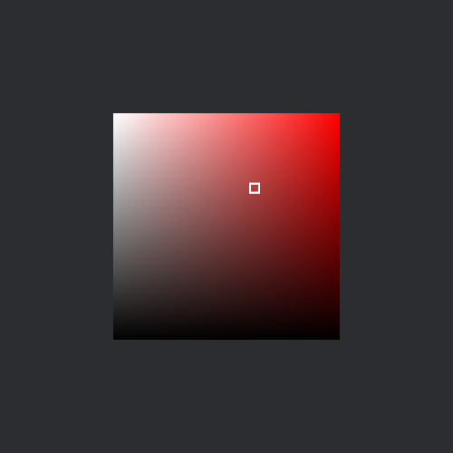
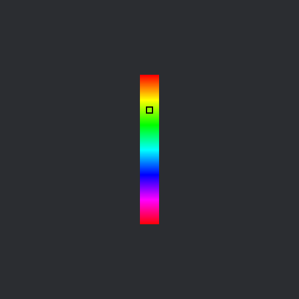
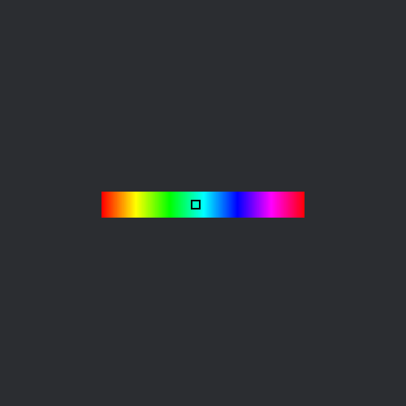

<div align="center">

# Iced Color Picker
[](https://docs.rs/iced_color_picker)
[](https://crates.io/crates/iced_color_picker)
[](https://github.com/B0ney/iced-color-picker/blob/main/LICENSE)

A simple, composable color picker widget for [iced](https://iced.rs).

## Demo

```shell
cargo run -p example
```




# Flavours

## Saturation and Value



## Vertical Hue


## Horizontal Hue

